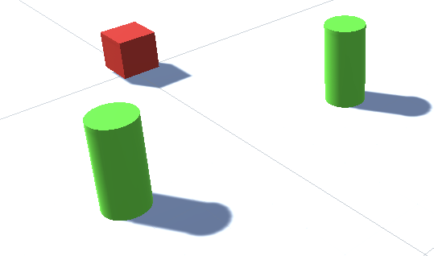
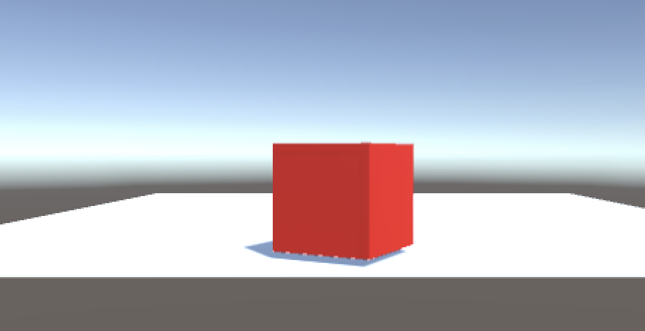
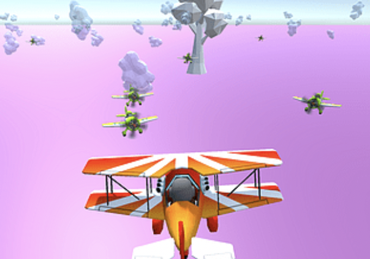
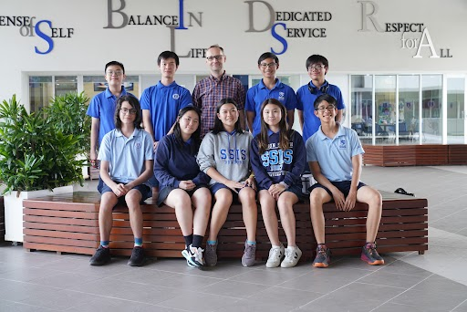

# Documentation

In hopefully chronological order the progress of our club will be documented

## 2022/10/07 Switch, While and Do While Loops, and instantiate

Starting with a funny (challenging) Kahoot! we went deeper into loops and instances. [See the slides on Canva](https://www.canva.com/design/DAFOKUNp9SU/wvR09d4HB3ZH4NISHU7cXA/edit?utm_content=DAFOKUNp9SU&utm_campaign=designshare&utm_medium=link2&utm_source=sharebutton)

``` c#
using UnityEngine;

public class Example : MonoBehaviour
{
    public GameObject prefab;
    void Start()
    {
        for (var i = 0: i < 10; i++)
        {
            Instantiate(prefab, new Vector3(i * 2.0f, 0, 0), Quaternion.identity);
        }
    }
}    
```

## 2022/09/23 Collision Detection - Rigid Bodies



Now that we have some red cubes, let's add a second object and detect the collision between them. The lines of code added to the `moveCube.cs` file are rather short. Inside the `moveCube` class we add another void function to `Start()` and `Update()`:

``` cs
    void OnCollisionEnter(Collision collision) {
        if (collision.gameObject.tag == "Environment") {
            Debug.Log("I crashed into a tree.");
        }
    }
```

Since it is already connected to the red cube we created it is automatically executed. But to make it work we have to add a few things:

- add `OnCollisionEnter()` function to the .cs code
- create a second object (cylinder - tree)
- add "Rigidbody" (not 2D) to the cube and tree object
- the BoxCollider object should be added automatically
- the objects now have a mass and react to gravity, moving in negative y direction


## 2022/09/16 Create first object, define variables of correct type and write first lines of code



We had an introduction to variables, declaration (C# is statically typed) and possible types (int, float, char, string, bool) and name conventions. After that a Kahoot! checked if we payed attention. Only 2 of 14 students scored 8/8!

You can follow the instructions on Youtube in [this video created by Soleil](https://youtu.be/1-uLP7GGcRc).

- Create a new project in Unity
- Add a cube
- Add the material "Red"
- Add the C# script "moveCube"
- Connect the script to the cube
- Enjoy your first interactive program!

Working code or script looks like this:

``` c#
using System.Collections;
using System.Collections.Generic;
using UnityEngine;

public class moveCube : MonoBehaviour
{
    float speed = 1.0f;
    
    // Start is called before the first frame update
    void Start()
    {
        Debug.Log("Successful started Unity Impact 2022 at SSIS.");        
    }

    // Update is called once per frame
    void Update()
    {
        if (Input.GetKey("up"))
        {
            transform.Translate(Vector3.up * speed * Time.deltaTime);
        }
        if (Input.GetKey("down"))
        {
            transform.Translate(Vector3.down * speed * Time.deltaTime);
        }
        if (Input.GetKey("left"))
        {
            transform.Translate(Vector3.left * speed * Time.deltaTime);
        }
        if (Input.GetKey("right"))
        {
            transform.Translate(Vector3.right * speed * Time.deltaTime);
        }        
        if (Input.GetKey("space"))
        {
            Debug.Log("Speed is " + speed + transform.position);
        }        
    }
}

```

## 2022/09/09 First meeting - What to expect



We want to create games, so the first meeting was about clarifying the objective for ourselves. Plus links to the software to install to be ready to code for the next session. We need:

- [Unity](https://unity.com/download)
- [Visual Studio Code](https://code.visualstudio.com/)

## 2023/02/08 Core club members in the second semester



In the last weeks of May the *Girls Code* club merged into our Unity club. Congratulations to Jocelyn, she made great progress in 2D and 3D programming, getting objects controlled and moving in a short period of time!
