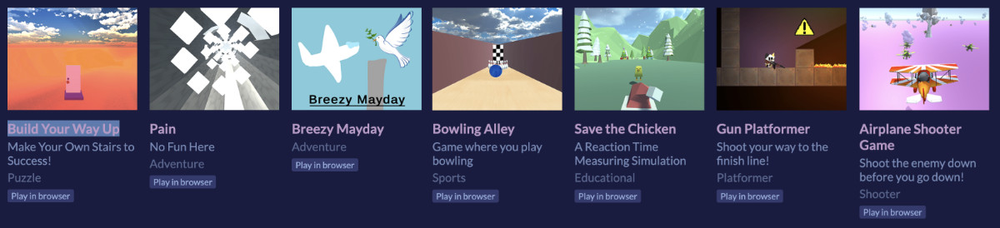

# unity2022

Documentation of progess at the Unity Impact Club 2022 at SSIS

## The club in social media

You can find out more at the website [sites.google.com/ssis.edu.vn/unityimpact](https://sites.google.com/ssis.edu.vn/unityimpact) and on our [Instagram account](https://www.instagram.com/unity_impact/) or on our [Youtube Channel]()

### Media:

- Website [https://sites.google.com/ssis.edu.vn/unityimpact](https://sites.google.com/ssis.edu.vn/unityimpact)
- Instagram [https://www.instagram.com/unity_impact/](https://www.instagram.com/unity_impact/)
- Youtube [Unity Impact](https://www.youtube.com/channel/UCYwXpmGJ3De0EM0Upb-92vg)
- itch.io [https://unityimpact.itch.io/](https://unityimpact.itch.io/)

## History

This will be documented in the [Documentation](Documentation) folder.

### Game Exibition March 3rd, 2023

After the first semester seven different games were developed. On the game exibition in MPR2 students had a chance to test their skills in these:

### Direct links to the games to start in your browser

- [Organize, My Friend in the Mirror](https://unityimpact.itch.io/organize-my-friend-in-the-mirror) by Nam
- [Build Your Way Up](https://unityimpact.itch.io/build-your-way-up) by Nam Le (LonelyDevil)
- [Pain](https://unityimpact.itch.io/pain) by Sean
- [Breezy Mayday](https://unityimpact.itch.io/mayday) by Matthew
- [Bowling Alley](https://unityimpact.itch.io/bowling-alley) by Yoyo
- [Save the Chicken](https://unityimpact.itch.io/save-the-chicken) by Soleil
- [Gun Platformer](https://unityimpact.itch.io/gun-platformer-demo) by Matthew
- [Airplane Shooter Game](https://unityimpact.itch.io/airplane-shooter-game) by Soleil
